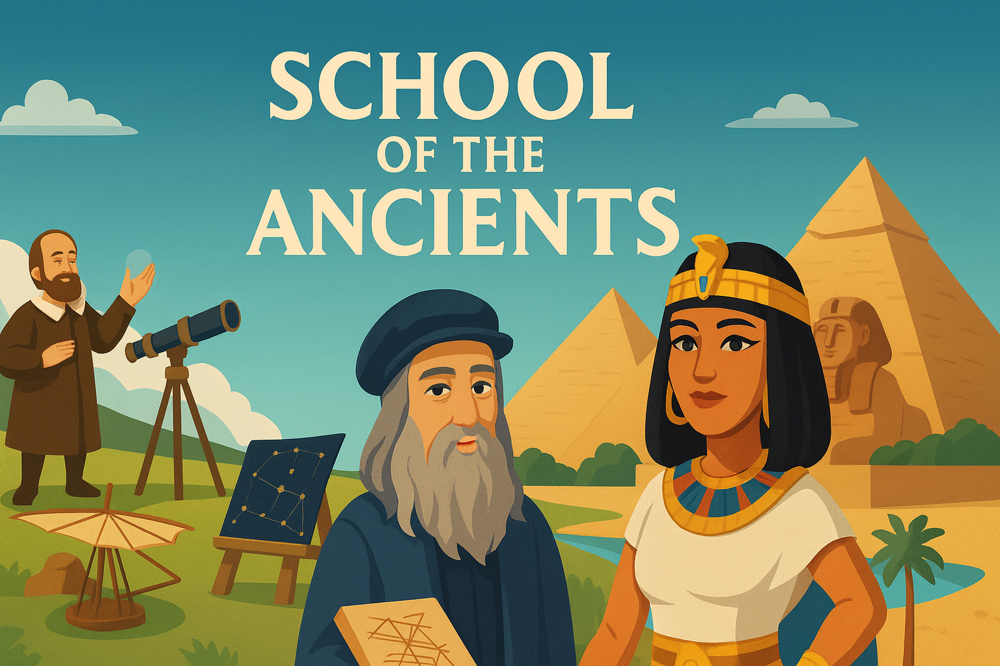

  

# School of the Ancients (VR / Meta Horizon Worlds)

**A remixable VR museum where you can meet Cleopatra, Galileo, and Leonardo da Vinci.**  
Built in 48 hours for the Meta Horizon Worlds AI NPC Remix competition (2025).

- **Published world:** https://horizon.meta.com/worlds/1459334171856325  
- **Devpost:** https://devpost.com/software/school-of-the-ancients  
- **Inspiration clip (Cosmos):** https://youtu.be/DKd-m-X1lyM

---

## Inspiration
This world was inspired by *Cosmos: Seven Wonders of the New World* — a vision of a future world fair where historical figures are brought back to life as simulations. I wanted to explore what a **virtual interactive museum/classroom** of the future could look like inside Horizon Worlds.

## What It Does
**School of the Ancients** is a remixable world where players can meet Cleopatra, Galileo, and Leonardo da Vinci. Each NPC can greet visitors, respond to simple prompts, and answer three themed questions about their life and legacy. Interactive props—**Galileo’s telescope**, **Cleopatra’s scepter**, and **Leonardo’s book of inventions**—add quick, tactile moments of engagement. A global ocean ambience ties the island together.

## How We Built It
- Started from the **AI NPC Examples** (Profit & Perish) and customized NPC backstories, prompts, and voices.  
- Procedurally generated the environment, then **baked and saved** it into assets/prefabs.  
- Designed **three zones**: Egyptian plaza (Cleopatra), hilltop observatory (Galileo), beach workshop (Leonardo).  
- Added **podiums with interactive buttons** (Yes / No / Tell me more + 3 custom questions per NPC).  
- Dressed each zone with props created via **Creator Assistant**.

## Challenges We Ran Into
- **AI Speech (Voice-Only)** currently doesn’t expose speech-to-text in scripts, so the interaction model relies on buttons, text prompts, and prop triggers.  
- Lost an early environment build by not baking the procedural output—rebuilt from the saved seed and adopted an aggressive checkpoint workflow.  
- Time constraint (48 hours) meant prioritizing **clarity + remixability** over mesh animation.

## Accomplishments
- Built a complete, remixable VR world in under 48 hours.  
- Demonstrated a **virtual museum/classroom** pattern other creators can extend to new figures.  
- Shipped onboarding UI and world preview images so others can quickly understand and remix.

## What We Learned
- **Modularity wins**: keep NPCs, props, and environments as separate prefabs.  
- Practical patterns for the **AI NPC Gizmo** and engagement states (Idle → Reacting → Yielding).  
- Small touches (props, ambient sound) make a space feel alive, even without full character animation.  
- The **Creator Assistant can generate 3D meshes and auto-texturize from prompts** (e.g., “Galileo astronomy tools”), and saving results as prefabs makes them easy to drag-and-drop and remix.

## Project History
- **2020 — Inspiration:** *Cosmos: Seven Wonders of the New World* → idea for a future World’s Fair with simulated historical figures.  
- **2024 — Google Gemini API Developer Competition (web prototype):** https://github.com/thetopham/schooloftheancients  
- **2025 — Meta Worlds (this VR build):** https://horizon.meta.com/worlds/1459334171856325

---

## Repo Contents
- `scripts/` — Horizon Worlds Desktop Editor TypeScript (UI, NPC comms, events).  
- `docs/` — design notes, environment seeds/prompts 
- `assets/` — models/textures exported by the author (e.g., FBX), banners, and images.

> Horizon Worlds world files and certain in-platform assets cannot be exported. This repo is the **source of truth** for code, prompts/seeds, exported models created by the author, and documentation.

---

## How to Remix (high level)
1. Open the world in **Horizon Worlds Desktop Editor**.  
2. Edit NPC prompts/backstories in the NPC Gizmo.  
3. Swap meshes/props (Cleopatra’s scepter, Galileo’s telescope, Leonardo’s book) via Asset Library or your own prefabs.  
4. If you regenerate the environment, **Group → Save as Asset** immediately (bake), then place the baked prefab.  
5. Publish as **Public + Remixable**, add preview images and a short description.

---

## Environment Generator Seeds
See `docs/enviroseed.png` for the exact prompts/seeds used to rebuild the environment

---

## Assets & Licensing
- **Models & textures** in `assets/` were created by the author (via Creator Assistant and manual edits) and exported by the owner.  
- If you reuse the assets from this repo, please follow the license below and provide attribution.
- Some assets may also exist as **Public Assets** in Horizon Worlds; list/IDs can be added to `assets/ASSET_MANIFEST.txt`.

**Licenses**  
- **Code:** MIT  
- **Models/Art (FBX/PNGs):** CC BY 4.0

---

## Roadmap
- Add more figures (Albert **Einstein**, Newton, Ada Lovelace).  
- Quests: “Ask me 3 things” unlocks a new exhibit.
- Quests: Bring the items to the different historical figures and see how they respond.   
- Voice input once STT becomes available to creators.  
- Expand into a connected **“World’s Fair of the Future”** hub of remixable exhibits.

---
